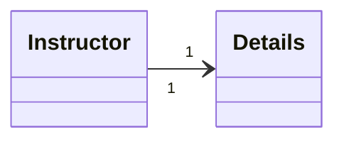

# SpringBoot OneToOne example (Instructor - Details)

## Description
This repository contains an SpringBoot example of entity - relationship of one-to-one, using the unidirectional relationship between instructor and details.

## Technologies
SpringBoot, Java, Maven, Postman, Swagger-UI, Git, Markdown, MySQL

## Execution
1. Create .env file with the following content:
```env
DB_URL=jdbc:mysql://localhost:3306/<database_name>
DB_USERNAME=<database_username>
DB_PASSWORD=<database_password>
```
2. From IntelliJ IDEA: run "Application" class.
3. Import SpringBoot.postman_collection.json to Postman or use Swagger-UI.

## API
### Endpoints
| Entity      | Method | Endpoint                           | Description                      |
|-------------|--------|------------------------------------|----------------------------------|
| Instructors | GET    | /instructors                       | List all instructors             |
| Instructors | GET    | /instructors/{id}                  | Get instructor by ID             |
| Instructors | POST   | /instructors/{id}                  | Create instructor                |
| Instructors | PUT    | /instructors/{id}                  | Update instructor                |
| Instructors | PUT    | /instructors/{id}/detail{idDetail} | Get detail from instructor by ID |
| Instructors | DELETE | /instructors/{id}                  | Delete instructor                |
| Details     | GET    | /details                           | List all details                 |
| Details     | GET    | /details/{id}                      | Get detail by ID                 |
| Details     | POST   | /details                           | Create detail                    |
| Details     | PUT    | /details/{id}                      | Update detail                    |
| Details     | DELETE | /details/{id}                      | Delete detail                    |

### Swagger-UI
[Request List](http://localhost:8080/swagger-ui.html)
- ⚠️Watch out! For pageable requests, it is necessary to remove the parameter <code>"sort": ["string"]</code> .⚠️

## Tree structure:
```batch
...
├── src
│   └── main
│       ├── java
│       │   └── zzz.master.REST.instructor.OTO
│       │       ├── Controllers
│       │       │   ├── InstructorController.java
│       │       ├── Entities
│       │       │   ├── DetailEntity.java
│       │       │   └── InstructorEntity.java
│       │       ├── Exceptions
│       │       │   └── ResourceNotFoundException.java
│       │       ├── Repositories
│       │       │   ├── DetailRepository.java
│       │       │   └── InstructorRepository.java
│       │       └── Application.java
│       └── resources
│           └── application.properties
├── .env
├── pom.xml
├── README.md
└── SpringBoot.postman_collection.json
```

## Relation
